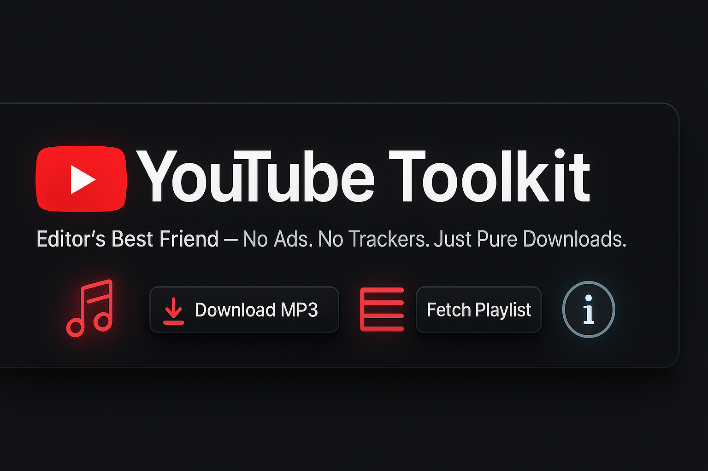

# 🎬 YouTube Toolkit

A modern, offline desktop application to download YouTube videos, playlists, audio (MP3), and extract metadata — now with Spotify & cookie support.



## 🚀 Features

- 📥 Download videos (up to 1080p)
- 🎵 Extract audio (MP3) from YouTube & Spotify
- 📃 Fetch and export playlist metadata
- 🔍 Get video thumbnails, titles, and descriptions
- 🔐 Support for age-restricted/private videos using cookies
- 🌓 Light & dark mode UI
- 💾 Fully offline — no login required

## 🛠️ Built With

- [Python 3.11](https://www.python.org/)
- [yt-dlp](https://github.com/yt-dlp/yt-dlp)
- [customtkinter](https://github.com/TomSchimansky/CustomTkinter)
- [ffmpeg](https://ffmpeg.org/)
- [spotdl](https://github.com/spotDL/spotify-downloader)

## 📁 Installation

### ✅ Option 1: Installer (Recommended)
1. Go to the [Releases](https://github.com/yourusername/youtube-toolkit/releases) page.
2. Download `YouTubeToolkitInstaller.exe` and run it.
3. Accept the prompts — app installs to `C:\Program Files\YouTubeToolkit`

### ⚙️ Option 2: Portable (for devs)
```bash
git clone https://github.com/yourusername/youtube-toolkit
cd youtube-toolkit
pip install -r requirements.txt
python main.py
```

## 🧩 How to Use Cookies (Age-Restricted/Private Videos)
1. Install [Get cookies.txt](https://chromewebstore.google.com/detail/get-cookiestxt-locally/cclelndahbckbenkjhflpdbgdldlbecc)Chrome extension.
2. Login to YouTube in Chrome.
3. Export cookies → Save as `youtube_cookies.txt`.
4. Upload inside the app settings.
5. The file is stored securely at `%APPDATA%\YouTubeToolkit\youtube_cookies.txt`

## 📸 Screenshots

| Home Screen | Playlist Tool |
|-------------|----------------|
|  |  |

## 🤝 Contributing
Pull requests welcome! Please format with `black`, use `snake_case`, and test before submitting.

## 📦 License

MIT License © 2025 [Your Name]

---

🔥 Made with love and yt-dlp by a developer who never skips the skip ads.
